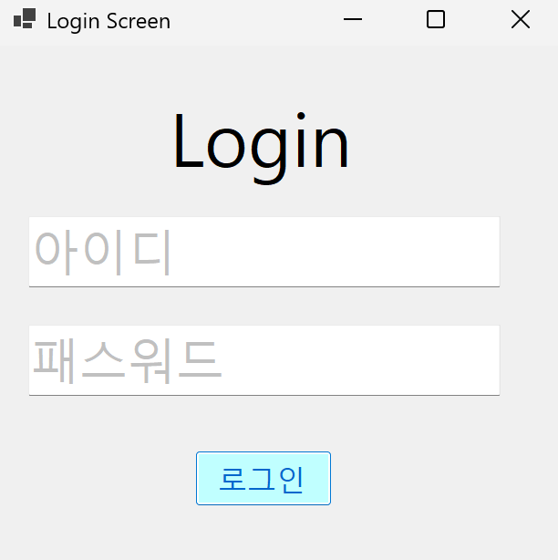
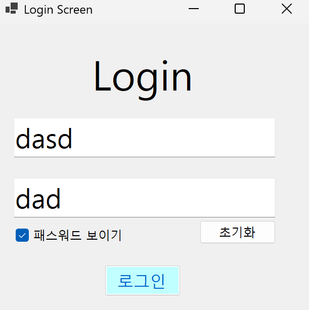

# (C# 코딩) LoginScreen

## 개요
- C# 프로그래밍 학습

- 1줄 소개 : 사용자의 텍스트 입력을 받아서 로그인 기능을 구현한 프로그램

- 사용한 플랫폼 :
  - ```C#```, ```.NET Windows Forms```, ```Visual Studio 2026```, ```GitHub``` 
  
- 사용한 컨트롤 :  
    - ```Label,TextBox, Button```
    
- 사용한 기술과 구현한 기능 :
  - **Windows Forms 앱 (C#)**: `Visual Studio`의 디자이너를 활용하여 직관적인 로그인 UI(Button, TextBox) 구성
  - **Placeholder 기능**: `TextBox`의 `ForeColor` 속성과 `string.IsNullOrWhiteSpace` 메서드를 활용하여 입력 힌트 표시
  - **로그인 처리**: 논리 연산자 `&&`와 `MessageBox.Show(string)`을 활용하여 로그인 성공 여부 처리
  - **Enter KeyDown 이벤트 처리**: `KeyDown` 이벤트와 `e.KeyCode == Keys.Enter` 조건문을 활용하여 Enter 키 입력 처리 
 
- 화면 구성 : 
  
  

## 실행 화면 (과제1)

- 과제1 코드의 실행 스크린샷


  - 과제 내용
    - 컨트롤 배치와 기본적인 속성 설정 
    - Placeholder로 입력창 안내하는 기능 구현
    - 아이디와 패스워드 처리 기능 구현
      
  - 구현 내용과 기능 설명
    - **UI 구성** : ```TextBox```(아이디, 패스워드), ```Button```(로그인)등을 적절히 배치
    - **Placeholder 표시** : 아이디와 패스워드 입력 힌트를 회색으로 표시
    - **로그인 가능 여부 체크 기능** : 아이디와 패스워드가 모두 맞아야 로그인 허용
    - **로그인 성공/실패 메시지 박스 보여주기**: 적절한 메시지 박스 사용
    
    - - **Enter KeyDown** : 아이디 입력 창에서 Enter 입력 시 포커스 이동, 패스워드 입력창에서 Enter키로 로그인 시도 가능하도록 구현
  - 사용한 기술과 구현한 기능
    - ```Label, TextBox, Button``` 컨트롤을 활용한 UI 구성
    - ```string.IsNullOrWhiteSpace```과 ```ForeColor```속성을 활용해 Placeholder 기능 구현
    - ```UseSystemPasswordChar```속성을 활용해 패스워드 입력 숨김 설정
    - 논리연산자 ```&&```와 ```MessageBox.Show(string)```을 활용해 로그인 성공 여부 처리 구현
    - ```KeyDown``` 이벤트와 ```e.KeyCode == Keys.Enter``` 조건문을 활용해 Enter 키 입력 처리 구현 
   
## 실행 화면 (과제2)

- 과제2 코드의 실행 스크린샷


- 과제 내용
    - 아이디 또는 패스워드가 잘못 입력되었을 때 에러 메시지 보여주기
    - MessageBox를 띄우지 말고 아이디와 패스워드를 입력하는 곳에 보여주기
      
- 구현 내용과 기능 설명
    - 에러 메시지를 숨겨놓고 아이디 또는 패스워드가 잘못 입력되었을 때 메시지를 보여주기
   
- 사용한 기술과 구현한 기능
    - ```Label``` 컨트롤 추가
    - ```Visible``` 속성을 활용하여 메시지 보이기와 숨기기 기능 구현

## 실행 화면 (과제3)

- 과제3 코드의 실행 스크린샷



- 과제 내용
    - 아이디와 패스워드를 빠르게 입력하고 로그인 할 수 있도록 편하게 만들기
      
- 구현 내용과 기능 설명
    - 패스워드 보이기/숨기기
    - 입력창 초기화
   
- 사용한 기술과 구현한 기능
    - ```CheckBox``` 컨트롤 추가
    - ```UseSystemPasswordChar``` 속성을 활용하여 패스워드 입력 숨김 

   